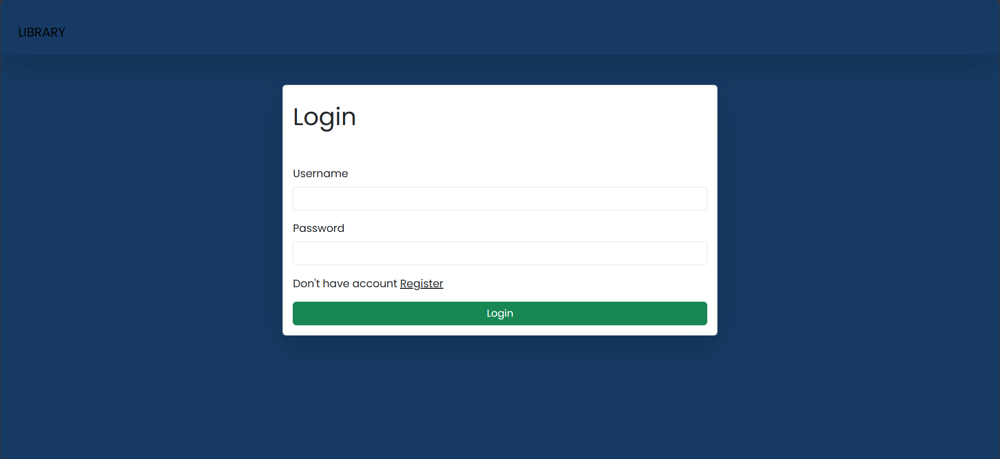
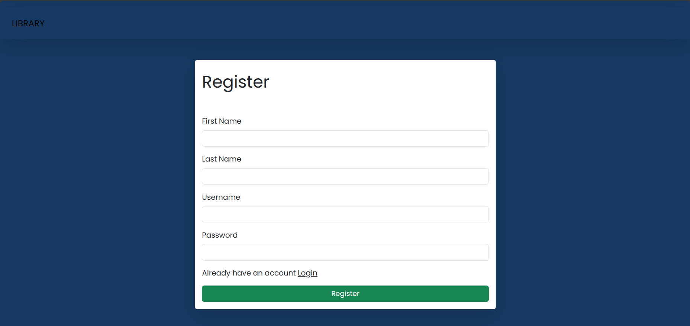
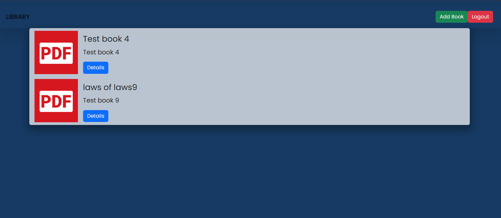
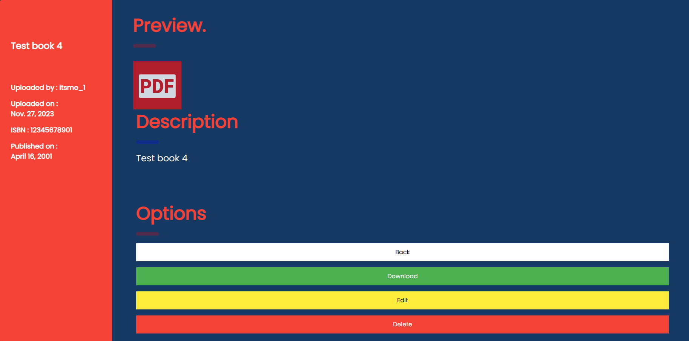
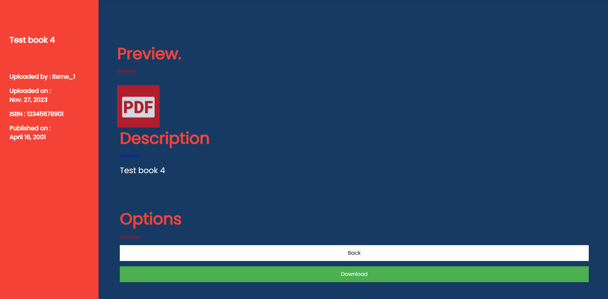
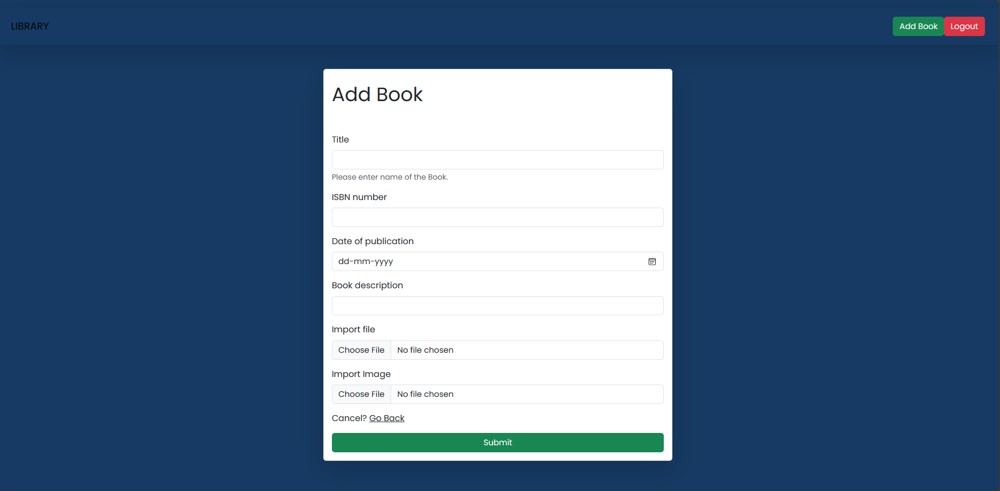
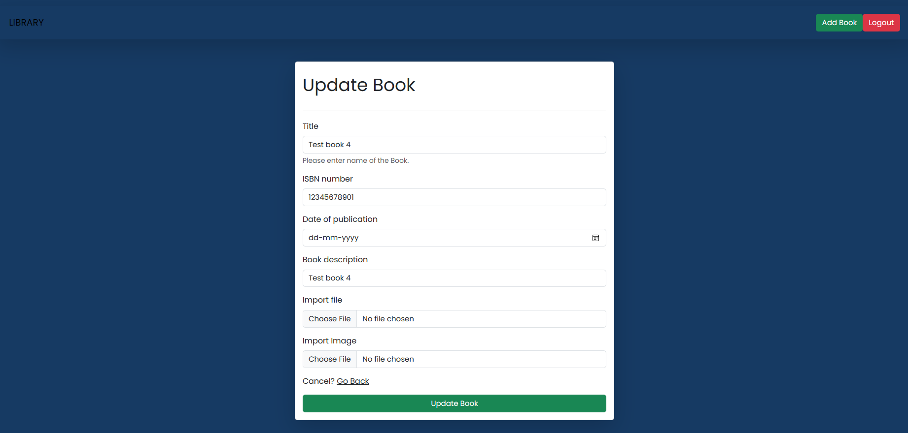
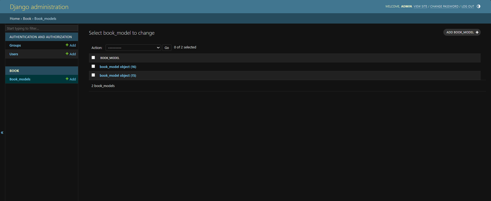
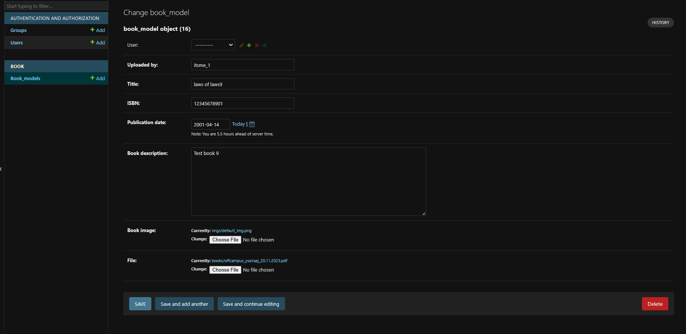

# Library
Library web-app using Django

This project uses Django to implement a Library webapp . This Web-App allows users to add new books , edit the books , and delete the books . This project also implements user authentication using inbuilt functionalities in Django . 

Salient features : 

1) Any user trying to use the Library web app will need to login first . If he does not have an account , he has to register (functionality is provided) .   
2) After Login , the person can view the homepage with list of all books . To view the details of a particular book , click on "Details" button provided . 
3) All the details of the book like preview image , description , publication date , ISBN , date of upload , name of uploader are available .  
4) Back button is also provided to go back to homepage .
5) Download button is provided to download the book .
6) Edit and Delete option is available to the user who has uploaded the file . Other users cannot edit or delete it (View of other user shown . Note that the option for edit and delete are not available) .   
7) Form to add new book and logout button both are provided in navbar .
8) requirements.txt contains all the dependencies .
9) Note :- Virtual environment was used to create the project . It contains two apps namely :- accounts , Book .
10) New book form and Edit book form are shown below .   
11) Admin interface is also provided . It can be used to create ,edit , delete books . User data can also be created , edited and deleted .  
12) However all the operations are provided by the webapp itself . So , all the operations on books can be done without admin interface too .


Steps to run the server in local machine :- 
1) ``` python -m venv ./Library_env ```
2) ``` cd Library_env\Scripts>  ```
3) ``` activate ```
4) This activates virtual environment .
5) Go to the code directory on your local machine where "requirements.txt" is located . There use this command .
6) ``` pip install -r requirements.txt ```
7) Assuming you are in the right directory(same directory) . Use
8) ``` python manage.py runserver ```
9) Server is online . Use it using port number shown .
